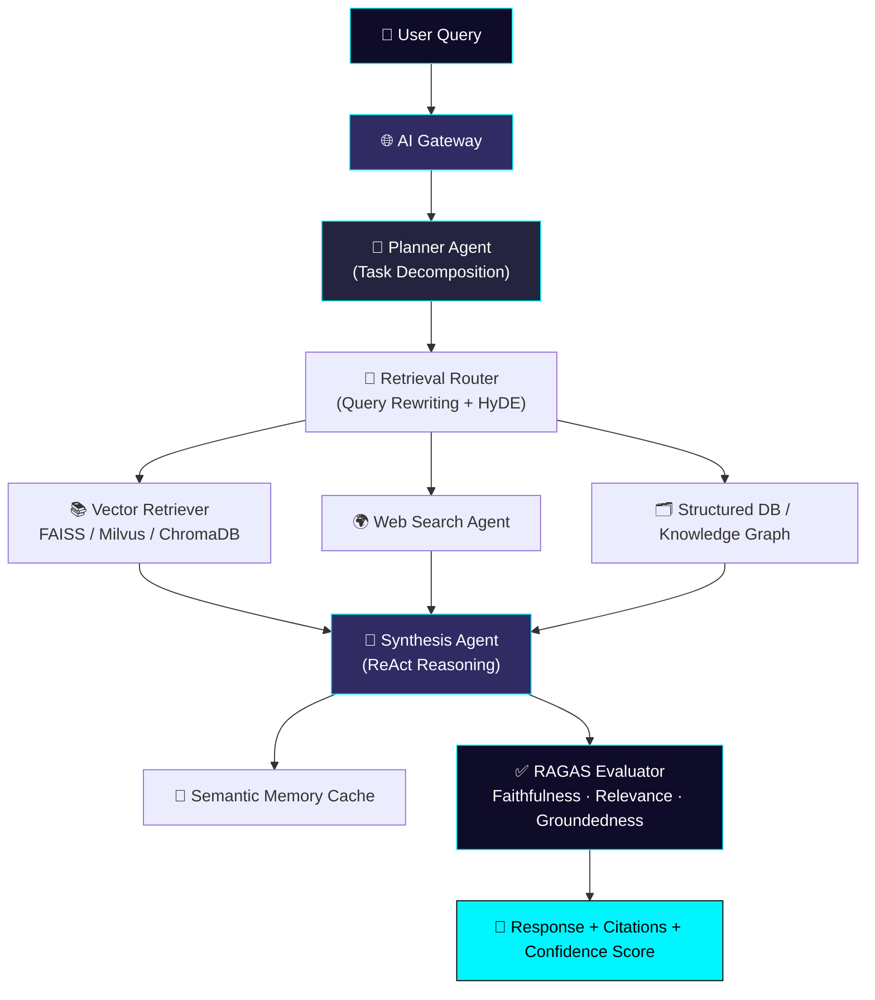
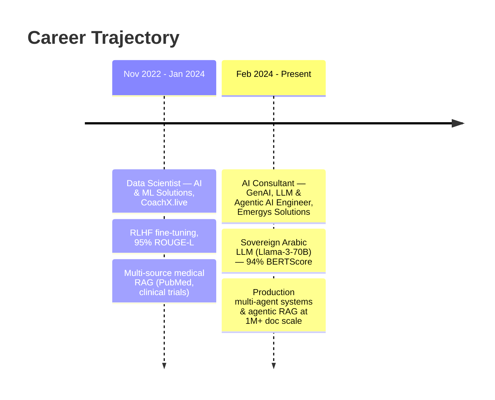

<div align="center">

<!-- ===================== NEON GRADIENT BANNER ===================== -->


<!-- ===================== ANIMATED TYPING HEADER ===================== -->
<a href="#">
  
</a>

<br/>

<!-- ===================== NAV / QUICK LINKS ===================== -->
[](https://hiteshjha.carrd.co/)
[](#)
[](https://www.linkedin.com/in/hitesh-jha2003/)
[](mailto:hjha03144@gmail.com)
[](#)


</div>

---

## 🧠 About Me

> Senior AI Engineer & Data Scientist specializing in **production LLM systems**, **autonomous multi-agent frameworks**, and **enterprise RAG pipelines**. I combine deep generative AI engineering with a strong classical ML foundation — building systems that go from ambiguous business problems to interpretable, reliable, production-grade AI.

<table align="center">
<tr>
<td align="center" width="25%"><b>3+</b><br/>Years of AI Engineering</td>
<td align="center" width="25%"><b>2</b><br/>Enterprise LLM Platforms Shipped</td>
<td align="center" width="25%"><b>50K+</b><br/>Embeddings / sec Throughput</td>
<td align="center" width="25%"><b>94%</b><br/>Faithfulness on Arabic LLM Benchmark</td>
</tr>
</table>

### 🎯 Current Focus
```diff
+ Agentic AI & Multi-Agent Orchestration (LangGraph, ReAct, CrewAI)
+ Enterprise-Scale Agentic RAG (1M+ document corpora)
+ LLM Fine-Tuning: LoRA / QLoRA / RLHF / DPO / PPO
+ GPU-Accelerated Inference & Model Compression (DeepSpeed, FlashAttention-2)
+ LLM Evaluation & Governance (RAGAS, Hallucination & Faithfulness Detection)
```

---

## 📡 Live System Status

<div align="center">

| Metric | Status |
|---|---|
| **Arabic LLM Faithfulness (BERTScore)** | `██████████` 94% |
| **RLHF Summarization (ROUGE-L)** | `██████████` 95% |
| **Predictive Maintenance Classifier Accuracy** | `██████████` 94% |
| **Model Compression (Quantization)** | `4x` size reduction, `<2%` accuracy loss |
| **Embedding Throughput** | `50K` embeddings / sec |
| **Retrieval Corpus Scale** | `1M+` documents indexed |
| **Robotic Telemetry Streams** | `50+` units, real-time via Kafka |

</div>

---

## 🏗️ Live Architecture — Agentic RAG Pipeline



---

## ⭐ Featured Projects

<table align="center">
<tr>
<td width="50%" valign="top">

### 🧩 Agentic RAG System — Multi-Source Retrieval
**Autonomous query planning + specialized retrieval agents**

`Python` `LangChain` `LlamaIndex` `ChromaDB` `Gemini` `Claude` `FastAPI` `Next.js` `WebSocket`

- Intelligent retrieval routing across multiple data sources with autonomous query planning
- Multi-agent orchestration: dedicated retrieval, web-search & synthesis agents using ReAct reasoning for dynamic tool selection

[`Code`](#) · [`Architecture`](#) · [`Live Demo`](#)

</td>
<td width="50%" valign="top">

### 📊 RAG Evaluation Framework
**Automated, MLflow-integrated evaluation pipeline**

`Python` `RAGAS` `LangChain` `Sentence-Transformers` `Pandas` `MLflow` `Pytest`

- Measures faithfulness, answer relevance, context precision/recall end-to-end
- Configurable hallucination thresholds with automated pipelines and metric logging

[`Code`](#) · [`Architecture`](#) · [`Live Demo`](#)

</td>
</tr>
<tr>
<td width="50%" valign="top">

### ⚙️ Industrial Robots Predictive Maintenance & Classifier
**Real-time telemetry from 50+ robotic units**

`PyTorch` `Scikit-learn` `XGBoost` `LightGBM` `Optuna` `PySpark` `Airflow` `FastAPI` `Grafana`

- LSTM Autoencoders + Isolation Forest for deep anomaly detection on multivariate time-series
- 94%-accuracy multi-class fault classifier with real-time Kafka/PySpark ingestion

[`Code`](#) · [`Architecture`](#) · [`Live Demo`](#)

</td>
<td width="50%" valign="top">

### 🕌 Sovereign Arabic LLM Platform — KSA-NLP-360
**Llama-3-70B fine-tuned for domain-specific Arabic NLP**

`Llama-3-70B` `LoRA` `QLoRA` `DeepSpeed ZeRO-3` `FlashAttention-2`

- 94% BERTScore faithfulness on domain-specific benchmarks
- 4x model compression via mixed-precision + INT4/INT8 quantization with <2% accuracy loss

[`Case Study`](#) · [`Architecture`](#)

</td>
</tr>
</table>

---

## 📈 Skills Radar

<div align="center">

| Domain | Proficiency |
|---|---|
| **LLMs & Generative AI** | `█████████████` |
| **Agentic AI / Multi-Agent Systems** | `██████████████` |
| **RAG & Retrieval Systems** | `██████████████` |
| **GPU & Distributed Training (CUDA/DeepSpeed)** | `██████████` |
| **MLOps & Deployment** | `████████████` |
| **Classical ML / Data Science** | `█████████████` |
| **Deep Learning (PyTorch/TensorFlow)** | `██████████████` |

</div>

---

## 🧰 Tech Stack

<div align="center">

**Languages & Scripting**


**Generative AI & Agentic Frameworks**


**Vector Databases & Retrieval**


**Deep Learning & GPU Computing**


**MLOps, Cloud & Deployment**


**Data & Classical ML**


</div>

---

## 🧭 Experience Timeline



---

## 📊 GitHub Analytics

<div align="center">


<!-- Contribution Snake — requires the snake workflow action enabled on this repo -->

</div>

> ℹ️ To activate the contribution snake above, add the `platane/snk` GitHub Action to a workflow in this repo — see [setup notes](#-snake-animation-setup) below.

---

## 🎓 Education

**Bachelor of Science in Computer Science**
Savitribai Phule Pune University, Pune, India
*Coursework: Machine Learning · Deep Learning · NLP · Data Structures & Algorithms · Database Systems · System Design · Statistics & Mathematics*

---

## 📬 Let's Connect

<div align="center">

[](mailto:hjha03144@gmail.com)
[](#)
[](https://www.linkedin.com/in/hitesh-jha2003/)
[](https://github.com/hiteshjha2003)


</div>

---

</details>
